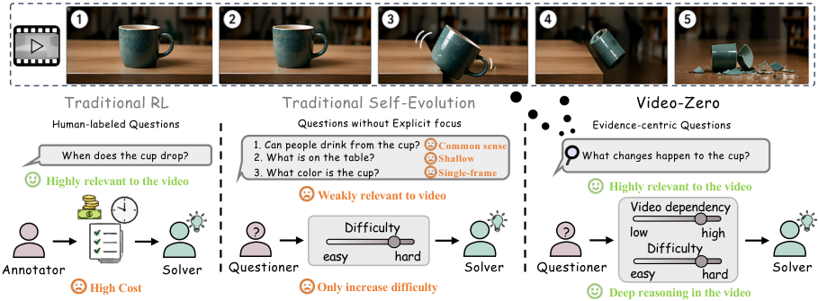
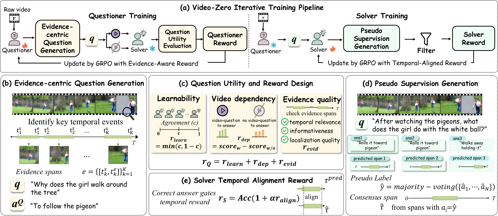
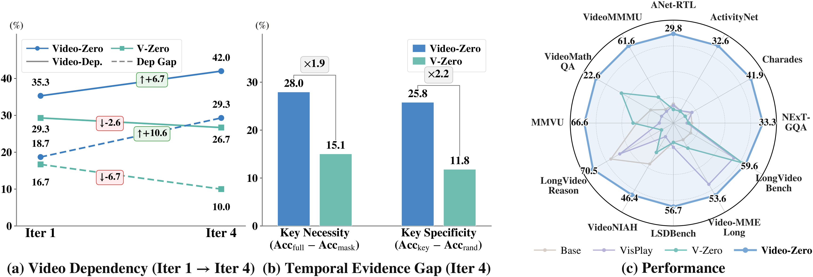

# Video-Zero: Self-Evolution Video Understanding

[](https://arxiv.org/abs/2605.14733)
[](LICENSE)

> **Video-Zero: Self-Evolution Video Understanding**
> Ruixu Zhang, Deyi Ji, Lanyun Zhu, Xuanyi Liu, Yuxin Meng, Ruihang Chu, Yujiu Yang
> *Tsinghua University · Tencent · Tongji University · Peking University*
> [arXiv:2605.14733](https://arxiv.org/abs/2605.14733)

<p align="center">
  
</p>
<p align="center"><i>
Traditional RL relies on costly labels; prior self-evolution often
increases difficulty without explicit evidence focus. <b>Video-Zero</b>
grounds question generation in evidence segments and co-evolves toward
video-dependent, challenging supervision.
</i></p>

## News

- **[2026-05]** v1 release — we open-source the **inference & evaluation code**
  and the **Qwen3-VL-4B / 8B Video-Zero checkpoints**
  ([4B](https://huggingface.co/muyu111/Video-Zero-4B) ·
  [8B](https://huggingface.co/muyu111/Video-Zero-8B)).
- **[2026-05]** Paper available on [arXiv](https://arxiv.org/abs/2605.14733).

## Overview

Video-Zero is an **annotation-free**, **evidence-centered** self-evolution
framework for general video understanding. Two policies share a single pretrained
backbone and co-evolve in a closed loop:

- **Questioner** — discovers temporally informative *evidence spans* in an
  unlabeled video and generates **evidence-grounded** questions, optimized
  with a video-aware utility (learnability + video-dependency + evidence
  quality).
- **Solver** — answers the question **and** predicts the supporting
  temporal span, supervised by pseudo labels and a temporal-alignment
  reward derived from rollout consensus.

By centering self-evolution on *temporally localized evidence* rather than
on raw difficulty, Video-Zero produces supervision that is genuinely
video-dependent — avoiding the static-cue / language-prior shortcuts that
naive transfers of text/image self-evolution to video are prone to.

We validate Video-Zero on **13 benchmarks** spanning temporal grounding,
long-video understanding, and video reasoning, on **Qwen3-VL-4B / 8B**.

<p align="center">
  
</p>
<p align="center"><i>
Overview of Video-Zero. (a) Self-evolution is organized around temporally
localized evidence. The Questioner (b) discovers key evidence spans and
generates evidence-grounded questions, which (c) are scored by
learnability, video dependency, and evidence quality. The Solver (d)
learns from rollout pseudo supervision and (e) is optimized with a
temporal-alignment reward, enabling closed-loop Questioner–Solver
co-evolution.
</i></p>

## Setup

```bash
pip install -r requirements.txt
```

All numbers in the paper were obtained with **Python 3.11.14**,
**PyTorch 2.8.0**, **transformers 4.57.0**, **vLLM 0.11.0**, and
**qwen-vl-utils 0.0.14** (CUDA 12).

Edit shared paths in [`Evaluation/paths.sh`](Evaluation/paths.sh) once
(or override them via environment variables); every `run_*.sh` will
pick them up automatically.

## Reproducing paper results — 13 benchmarks

<p align="center">
  
</p>
<p align="center"><i>
Evidence-centered analysis and performance. Video-Zero improves
(a) video dependency, (b) key-span necessity and specificity in
generated questions, and (c) overall performance across 13 benchmarks.
</i></p>

We evaluate on **13 benchmarks** in total:

- **MMVU, VideoMathQA, VideoMMMU, LongVideoReason, Charades-STA,
  ActivityNet, ANet-RTL** — following
  [OneThinker](https://github.com/tulerfeng/OneThinker)
  (same task list, prompts, and metrics).
- **[NExT-GQA](https://github.com/doc-doc/NExT-GQA),
  [LSDBench](https://github.com/JIA-Lab-research/LSDBench),
  [VideoNIAH](https://github.com/joez17/VideoNIAH)** —
  following each benchmark's official protocol, with the
  scripts in this repo.
- **LongVideoBench, MLVU, Video-MME-Long** — using the standard
  [VLMEvalKit](https://github.com/open-compass/VLMEvalKit) pipeline
  (register the checkpoint as a `Qwen3VLChat` model).

Set the dataset paths in `Evaluation/paths.sh`, then:

```bash
# OneThinker 7-task suite
bash Evaluation/run_onethinker.sh

# NExT-GQA / LSDBench / VideoNIAH
bash Evaluation/run_nextgqa.sh
bash Evaluation/run_lsdbench.sh
bash Evaluation/run_vnbench.sh
```

## Models

Released checkpoints on Hugging Face:

| Backbone               | Checkpoint                                                                              |
| ---------------------- | --------------------------------------------------------------------------------------- |
| Qwen3-VL-4B-Instruct   | [`muyu111/Video-Zero-4B`](https://huggingface.co/muyu111/Video-Zero-4B)                 |
| Qwen3-VL-8B-Instruct   | [`muyu111/Video-Zero-8B`](https://huggingface.co/muyu111/Video-Zero-8B)                 |

Each repository contains five sub-folders `v1/` … `v5/`, corresponding to
the five co-evolution iterations. **We recommend `v4`** as the default
checkpoint (best overall trade-off across the 13 benchmarks).

Download with the Hugging Face CLI and point the scripts to the chosen round:

```bash
# Download all rounds (v1–v5)
hf download muyu111/Video-Zero-4B --local-dir ./Video-Zero-4B

# Or download only a specific iteration (e.g. v4)
hf download muyu111/Video-Zero-4B --include "v4/*" --local-dir ./Video-Zero-4B
```

## Citation
If you find Video-Zero helpful, please consider giving the repo a star ⭐.

If you find our work helpful for your research, please consider citing our work.

```bibtex
@article{zhang2026videozero,
  title   = {Video-Zero: Self-Evolution Video Understanding},
  author  = {Zhang, Ruixu and Ji, Deyi and Zhu, Lanyun and Liu, Xuanyi and
             Meng, Yuxin and Chu, Ruihang and Yang, Yujiu},
  journal = {arXiv preprint arXiv:2605.14733},
  year    = {2026}
}
```


## Acknowledgement

Our training pipeline is built on top of
[verl](https://github.com/volcengine/verl). Evaluation in this
repository follows
[OneThinker](https://github.com/tulerfeng/OneThinker) and
[VLMEvalKit](https://github.com/open-compass/VLMEvalKit), and uses
[Qwen3-VL](https://github.com/QwenLM/Qwen3-VL) as the backbone with
[vLLM](https://github.com/vllm-project/vllm) for inference.
We thank the authors for their excellent open-source contributions.
